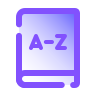
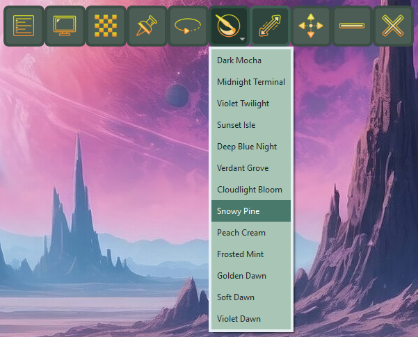
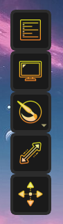

# 💡 PyTranslate Nedir?

Yabancı forumlar, dokümanlar veya oyunlar gibi içeriklerde çeviri ihtiyacı sık yaşanıyor. Ancak mevcut çeviri çözümleri ya sürekli açık bir web sayfasına bağımlıydı, ya da bir görüntüden metin çevirmek için ekran görüntüsü al, siteye yükle, bekle gibi zaman kaybettiren adımlar içeriyordu. Bu hem odak kaybına neden oluyor hem de süreci gereksiz yere uzatıyordu.

Bu eksikliklerden yola çıkarak, **hızlı, pratik ve odağı bozmayan** bir çeviri aracı ihtiyacını fark ettim — ve **PyTranslate**'i geliştirdim.

## 🚀 Ne Yapar?

PyTranslate, ekranın herhangi bir köşesinde yer alabilen küçük bir araç çubuğu şeklinde çalışır.  

-🔹 **Metin tabanlı çeviri**  
-🔹 **Anlık ekran üzerindeki yazıyı tanıma ve çeviri (OCR destekli)**  
-🔹 **Minimum dikkat dağınıklığı, maksimum verimlilik**

Yani:  
**“İşimden kopmadan çeviri yapmamı sağlayan kişisel bir yardımcı.”**

## 🎯 Neden PyTranslate?

- ✅ Arka planda web sitesi açık tutma derdi yok  
- ✅ Görselden çeviri için karmaşık adımlar yok  
- ✅ Her şey hızlı, sade ve erişilebilir  
- ✅ Çalışma akışını bölmeden yardımcı olur

## 📄 Nasıl Çalışır?

- Uygulamanın ana penceresi bir **araç çubuğu** şeklindedir.  
- Kullanıcıya **metin çevirme** veya **resimdeki metni algılayıp çevirme** seçenekleri sunar.  
- Yazılım dili: **Python**  
- Arayüz: **PyQt5**  
- OCR (görüntüden metin algılama) işlemi için: **pytesseract** ve onun dil modelleri  
- Çeviri işlemleri için: **deep-translator** kütüphanesi  
- Kelime düzeltme için: **language-tool-python** kullanılır  
- Projeyle ilgili tüm kütüphane ve bağımlılıklar `requirements.txt` dosyasında listelenmiştir.

## 📦 İndir

Tüm ortamlarda bağımsız çalışabilmesi için bağlantıdan kurulum dosyasını indirebilirsin:

📥 [PyTranslate Kurulum Dosyasını İndir](https://github.com/Abdullahtsn/PyTranslate/releases/tag/v1.0.0)

> ⚠️ **Not:** Kurulum dosyası (`setup.exe`), PyTranslate’in bağımsız olarak çalışabilmesi için hazırlanmıştır.  
> Yani Python ya da ek kütüphaneler sisteminde kurulu olmasa bile, bu kurulum dosyası sayesinde uygulamayı doğrudan çalıştırabilirsin.  
>
> Uygulama tamamen açık kaynak kodludur ve GitHub sayfasında tüm kodları şeffaf bir şekilde paylaşıyorum.  
>  
> İstersen kendin derleyebilir, hatta kendi sisteminde çalıştırarak güvenliğini bizzat test edebilirsin.

## 🔘 Butonlar ve İşlevleri

  
  <strong>Çıkış:</strong> Uygulamayı kapatır.

  
  <strong>Tam ekran:</strong> Pencereyi tam ekran yapar.

  
  <strong>Küçült:</strong> Görev çubuğuna küçültür.

  
  <strong>Taşı:</strong> Pencereyi sürükleyerek taşımanı sağlar.

  
  <strong>İpuçları:</strong> Butonların açıklamalarını gösterir.

---

  
  <strong>Metin Çevirisi:</strong> Metin Çeviri penceresini açar.

  
  <strong>Ekran Çevirisi:</strong> Ekrandan seçilen bölgedeki metinleri algılar, metin çevirisine gönderir. (Dil seçimine göre algılama yapar.)

  
  <strong>Saydamlaştır:</strong> Uygulamayı kısmen arka planı görünecek şekilde ayarlar.

  
  <strong>Sabitle:</strong> Uygulamayı her zaman en üstte tutar.

  
  <strong>Döndür:</strong> Uygulama yatay ve dikey kullanımlar arasında geçiş yapar.

  
  <strong>Tema:</strong> Koyu ve açık renk paletleriyle uygulama tasarımını değiştirir.

  
  <strong>Küçült:</strong> Fazlalık butonları gizleyerek uygulamanın kapladığı alanı küçültür.

---

  
  <strong>Dil Değişimi:</strong> Çevrilecek ve çevrilen dil seçiminin yerlerini değiştirir.

  
  <strong>Metin Değişimi:</strong> Çevrilecek ve çevrilen metinlerinin yerlerini değiştirir.

  
  <strong>Kelime Düzeltme:</strong> Çevrilecek metindeki kelime yanlışlarını düzeltir. (Türkçe dil desteği yok.)

  
  <strong>Dil Varyantlarını:</strong> Dil seçimi için o dilin farklı bölgelerdeki varyantlarını dahil eder.

  
  <strong>Çevir:</strong> Çeviri yapar. (ENTER tuşuyla da yapılabilir.)

  
  <strong>Kopyala:</strong> Bağlı olduğu yerde ki metni kopyalar.

  
  <strong>Yapıştır:</strong> Bağlı olduğu yere kopyalanan metni yapıştırır.

  
  <strong>Temizle:</strong> Bağlı olduğu yerdeki metni siler.

## 🎨 Tema Galerisi - Theme Gallery

    
    
    
    
    
    
    
    
    
    
    
    
    
    
    

--------------------------------------------

English Guide

# 💡 What is PyTranslate?

The need for translation often arises in foreign forums, documents, or games. However, existing translation solutions either depend on constantly having a web page open or involve time-consuming steps like taking a screenshot, uploading it to a site, and waiting to translate text from an image. This causes loss of focus and unnecessarily prolongs the process.

Based on these shortcomings, I realized the need for a **fast, practical, and non-distracting** translation tool — and developed **PyTranslate**.

## 🚀 What Does It Do?

PyTranslate works as a small toolbar that can be placed in any corner of the screen.

- 🔹 **Text-based translation**  
- 🔹 **Instant recognition and translation of text on the screen (OCR supported)**  
- 🔹 **Minimal distraction, maximum efficiency**

In other words:  
**“A personal assistant that lets me translate without breaking my workflow.”**

## 🎯 Why PyTranslate?

- ✅ No need to keep a website open in the background  
- ✅ No complicated steps for image translation  
- ✅ Everything is fast, simple, and accessible  
- ✅ Helps without interrupting your workflow

## 📄 How Does It Work?

- The main window of the application is in the form of a **toolbar**.  
- It offers users options to **translate text** or **detect and translate text from images**.  
- Programming language: **Python**  
- Interface: **PyQt5**  
- For OCR (text recognition from images): **pytesseract** and its language models  
- For translation: **deep-translator** library  
- For word correction: **language-tool-python** is used  
- All related libraries and dependencies are listed in the `requirements.txt` file.

## 📦 Download

You can download the setup file from the link below to run independently on any system:

📥 [Download PyTranslate Setup File](https://github.com/Abdullahtsn/PyTranslate/releases/tag/v1.0.0)

> ⚠️ **Note:** The setup file (`setup.exe`) is prepared so that PyTranslate can run independently.  
> That means even if Python or additional libraries are not installed on your system, you can run the application directly with this setup file.  
>  
> The application is fully open source and all the code is transparently shared on the GitHub page.  
>  
> You can compile it yourself or test its security by running it on your own system.

## 🔘 Buttons and Their Functions

  
  <strong>Close:</strong> Closes the application.

  
  <strong>Fullscreen:</strong> Makes the window fullscreen.

  
  <strong>Minimize:</strong> Minimizes the window to the taskbar.

  
  <strong>Move:</strong> Allows you to drag and move the window.

  
  <strong>Tips:</strong> Shows descriptions of the buttons.

---

  
  <strong>Text Translation:</strong> Opens the text translation window.

  
  <strong>Screen Translation:</strong> Detects text in the selected screen area and sends it for translation. (Detection depends on the selected language.)

  
  <strong>Transparency:</strong> Sets the application to be partially transparent to show the background.

  
  <strong>Pin:</strong> Keeps the application always on top.

  
  <strong>Rotate:</strong> Switches the application between horizontal and vertical modes.

  
  <strong>Theme:</strong> Changes the application design with dark and light color palettes.

  
  <strong>Collapse:</strong> Hides extra buttons to reduce the application's occupied space.

---

  
  <strong>Swap Languages:</strong> Switches the source and target languages.

  
  <strong>Swap Texts:</strong> Swaps the source and translated texts.

  
  <strong>Word Correction:</strong> Corrects word mistakes in the text to be translated. (No Turkish language support.)

  
  <strong>Language Variants:</strong> Includes different regional variants of the selected language.

  
  <strong>Translate:</strong> Performs the translation. (Can also be triggered with the ENTER key.)

  
  <strong>Copy:</strong> Copies the text from the associated field.

  
  <strong>Paste:</strong> Pastes the copied text into the associated field.

  
  <strong>Clear:</strong> Clears the text in the associated field.

